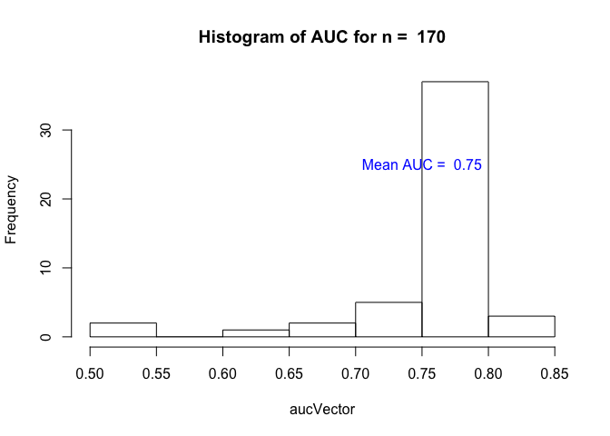
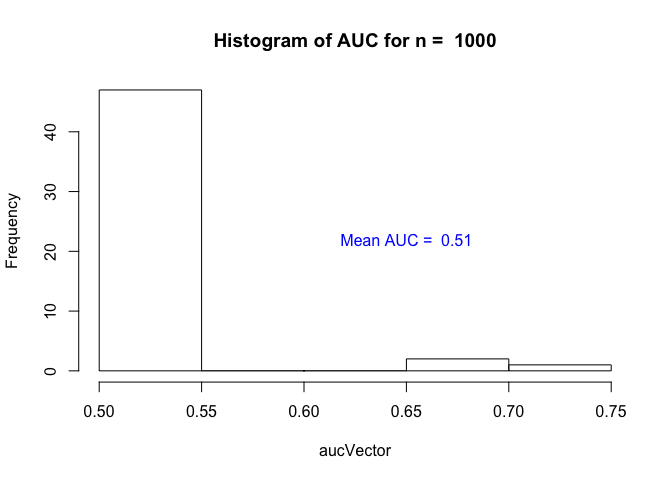
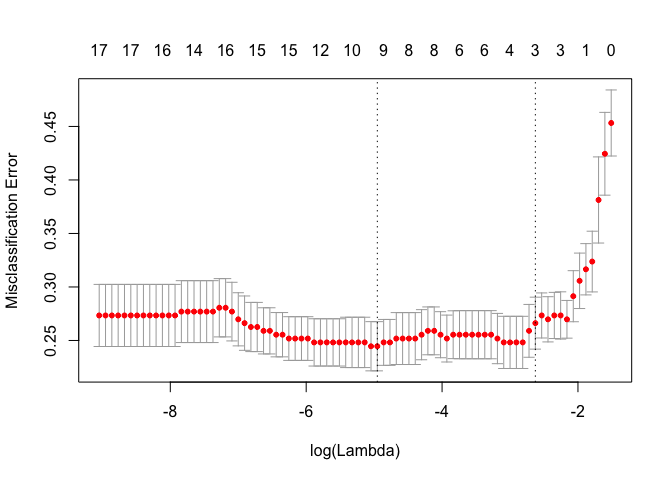

seismic.Rmd
================
Shravan Kuchkula, Dave Dyer, Tommy Pompo
12/03/2017

-   [Introduction](#introduction)
-   [Getting the data](#getting-the-data)
-   [Data set description](#data-set-description)
    -   [Variable Types and Cardinality](#variable-types-and-cardinality)
-   [Exploratory Data Analysis](#exploratory-data-analysis)
    -   [How are nbumps distributed ?](#how-are-nbumps-distributed)
    -   [Logistic Regression Assumptions](#logistic-regression-assumptions)
-   [Problem with unbalanced class variable](#problem-with-unbalanced-class-variable)
    -   [Full Model](#full-model)
    -   [Null Model](#null-model)
-   [Balancing the class variable](#balancing-the-class-variable)
-   [Logistic Regression using with balanced dataset with train/test split](#logistic-regression-using-with-balanced-dataset-with-traintest-split)
-   [Evaluating model performance using Cross Validation](#evaluating-model-performance-using-cross-validation)
-   [Comparing the performance of classification techniques.](#comparing-the-performance-of-classification-techniques.)
-   [References](#references)

Introduction
------------

The dangers associated with coal mining are myriad; black lung, flammable gas pockets, rockbursts, and tunnel collapses are all very real dangers that mining companies must consider when attempting to provide safe working conditions for miners. One class of mining hazard, commonly called 'seismic hazards', are notoriously difficult to protect against and even more difficult to predict with certainty. Therefore, predicting these hazards has become a well-known problem for machine learning and predictive analytics. The UCI Machine Learning Repository (<https://archive.ics.uci.edu>) provides a 'seismic bumps' data set that contains many records of combined categorical and numeric variables that could be used to predict seismic hazards. This 'seismic bumps' data set can be found at <https://archive.ics.uci.edu/ml/datasets/seismic-bumps>.

Our analysis attempts to use logistic regression techniques to predict whether a seismic 'bump' is predictive of a notable seismic hazard. We attempt to characterize our prediction accuracy and compare the results against the state of the art results from other statistical and machine learning techniques, that are included within the data set.

Getting the data
----------------

``` r
source("libraries.R")
#url <- "https://archive.ics.uci.edu/ml/machine-learning-databases/00266/seismic-bumps.arff"
#download.file(url, "seismic-bumps.arff")
seismicData <- import("seismic-bumps.arff")
```

Data set description
--------------------

The data were taken from from instruments in the Zabrze-Bielszowice coal mine, in Poland. There are 2,584 records, with only 170 class = 1 variables, so the data are significantly skewed towards non-hazardous training data. Field descriptions are below, but essentially energy readings and bump counts during one work shift are used to predict a 'hazardous' bump during the next shift. From the data description, a 'hazardous bump' is a seismic event with &gt; 10,000 Joules, and a 'shift' is a period of 8 hours. For the sake of reference, a practical example of 10,000 Joules would be the the approximate energy required to lift 10,000 tomatoes 1m above the ground. A class = 1 variable result signifies that a harzardous bump did, indeed, occur in the following shift to the measured data. Here is an example of the fields in the data set.

    ## Observations: 2,584
    ## Variables: 19
    ## $ seismic        <fctr> a, a, a, a, a, a, a, a, a, a, a, a, a, a, a, a...
    ## $ seismoacoustic <fctr> a, a, a, a, a, a, a, a, a, a, a, a, a, a, a, b...
    ## $ shift          <fctr> N, N, N, N, N, W, W, N, N, W, N, N, W, N, N, W...
    ## $ genergy        <dbl> 15180, 14720, 8050, 28820, 12640, 63760, 207930...
    ## $ gpuls          <dbl> 48, 33, 30, 171, 57, 195, 614, 194, 303, 675, 1...
    ## $ gdenergy       <dbl> -72, -70, -81, -23, -63, -73, -6, -27, 54, 4, -...
    ## $ gdpuls         <dbl> -72, -79, -78, 40, -52, -65, 18, -3, 52, 25, -3...
    ## $ ghazard        <fctr> a, a, a, a, a, a, a, a, a, a, a, a, a, a, a, a...
    ## $ nbumps         <dbl> 0, 1, 0, 1, 0, 0, 2, 1, 0, 1, 1, 0, 1, 1, 1, 2,...
    ## $ nbumps2        <dbl> 0, 0, 0, 0, 0, 0, 2, 0, 0, 1, 0, 0, 1, 0, 1, 0,...
    ## $ nbumps3        <dbl> 0, 1, 0, 1, 0, 0, 0, 1, 0, 0, 1, 0, 0, 1, 0, 2,...
    ## $ nbumps4        <dbl> 0, 0, 0, 0, 0, 0, 0, 0, 0, 0, 0, 0, 0, 0, 0, 0,...
    ## $ nbumps5        <dbl> 0, 0, 0, 0, 0, 0, 0, 0, 0, 0, 0, 0, 0, 0, 0, 0,...
    ## $ nbumps6        <dbl> 0, 0, 0, 0, 0, 0, 0, 0, 0, 0, 0, 0, 0, 0, 0, 0,...
    ## $ nbumps7        <dbl> 0, 0, 0, 0, 0, 0, 0, 0, 0, 0, 0, 0, 0, 0, 0, 0,...
    ## $ nbumps89       <dbl> 0, 0, 0, 0, 0, 0, 0, 0, 0, 0, 0, 0, 0, 0, 0, 0,...
    ## $ energy         <dbl> 0, 2000, 0, 3000, 0, 0, 1000, 4000, 0, 500, 500...
    ## $ maxenergy      <dbl> 0, 2000, 0, 3000, 0, 0, 700, 4000, 0, 500, 5000...
    ## $ class          <fctr> 0, 0, 0, 0, 0, 0, 0, 0, 0, 0, 0, 0, 0, 0, 0, 0...


From the UCI Machine Learning Repository, these are the field descriptions:

-   **seismic**: result of shift seismic hazard assessment in the mine working obtained by the seismic method (a - lack of hazard, b - low hazard, c - high hazard, d - danger state);
-   **seismoacoustic**: result of shift seismic hazard assessment in the mine working obtained by the seismoacoustic method;
-   **shift**: information about type of a shift (W - coal-getting, N -preparation shift);
-   **genergy**: seismic energy recorded within previous shift by the most active geophone (GMax) out of geophones monitoring the longwall;
-   **gpuls**: a number of pulses recorded within previous shift by GMax;
-   **gdenergy**: a deviation of energy recorded within previous shift by GMax from average energy recorded during eight previous shifts;
-   **gdpuls**: a deviation of a number of pulses recorded within previous shift by GMax from average number of pulses recorded during eight previous shifts;
-   **ghazard**: result of shift seismic hazard assessment in the mine working obtained by the seismoacoustic method based on registration coming form GMax only;
-   **nbumps**: the number of seismic bumps recorded within previous shift;
-   **nbumps2**: the number of seismic bumps (in energy range \[10<sup>2,10</sup>3)) registered within previous shift;
-   **nbumps3**: the number of seismic bumps (in energy range \[10<sup>3,10</sup>4)) registered within previous shift;
-   **nbumps4**: the number of seismic bumps (in energy range \[10<sup>4,10</sup>5)) registered within previous shift;
-   **nbumps5**: the number of seismic bumps (in energy range \[10<sup>5,10</sup>6)) registered within the last shift;
-   **nbumps6**: the number of seismic bumps (in energy range \[10<sup>6,10</sup>7)) registered within previous shift;
-   **nbumps7**: the number of seismic bumps (in energy range \[10<sup>7,10</sup>8)) registered within previous shift;
-   **nbumps89**: the number of seismic bumps (in energy range \[10<sup>8,10</sup>10)) registered within previous shift;
-   **energy**: total energy of seismic bumps registered within previous shift;
-   **maxenergy**: the maximum energy of the seismic bumps registered within previous shift;
-   **class**: the decision attribute - '1' means that high energy seismic bump occurred in the next shift ('hazardous state'), '0' means that no high energy seismic bumps occurred in the next shift ('non-hazardous state').

### Variable Types and Cardinality

There are 18 input variables and one binary output variable ("class"). The data are mostly numeric with 4 categorical input variables. However, some of the numeric values only contain a handful of discrete values which can be viewed as coded categorical variables. In particular, maxenergy and the 'nbumps(n)' variables can be treated as categorical. So, in short, we see the following breakdown in variable types:

The categorical variables are seismic, seismoacoustic, shift, ghazard, nbumps, nbumps2, nbumps3, nbumps4, nbumps5, nbumps6, nbumps7, nbumps89, class and the continuous variables are genergy, gdpuls, energy, maxenergy. The output variable is 'class'.

A table outlining the variables and some of their attributes is below:

           variable Cardinality Nulls Total   Uniqueness Distinctness
              class           2     0  2584 0.0007739938 0.0007739938
             energy         242     0  2584 0.0936532508 0.0936532508
           gdenergy         334     0  2584 0.1292569659 0.1292569659
             gdpuls         292     0  2584 0.1130030960 0.1130030960
            genergy        2212     0  2584 0.8560371517 0.8560371517
            ghazard           3     0  2584 0.0011609907 0.0011609907
              gpuls        1128     0  2584 0.4365325077 0.4365325077
          maxenergy          33     0  2584 0.0127708978 0.0127708978
             nbumps          10     0  2584 0.0038699690 0.0038699690
            nbumps2           7     0  2584 0.0027089783 0.0027089783
            nbumps3           7     0  2584 0.0027089783 0.0027089783
            nbumps4           4     0  2584 0.0015479876 0.0015479876
            nbumps5           2     0  2584 0.0007739938 0.0007739938
            nbumps6           1     0  2584 0.0003869969 0.0003869969
            nbumps7           1     0  2584 0.0003869969 0.0003869969
           nbumps89           1     0  2584 0.0003869969 0.0003869969
            seismic           2     0  2584 0.0007739938 0.0007739938
     seismoacoustic           3     0  2584 0.0011609907 0.0011609907
              shift           2     0  2584 0.0007739938 0.0007739938

Exploratory Data Analysis
-------------------------

It is important to understand how many observations are "hazardous state (class = 1)" and "non-hazardous state (class = 0)"

``` r
table(seismicData$class)
```

    ## 
    ##    0    1 
    ## 2414  170

As mentioned above, the data set output variable is highly skewed, and contains many more non-hazardous classes than it does hazardous classes.

### How are nbumps distributed ?

Distribution of all nbumps: Use `cowplot` to display all nbumps in a grid. 

### Logistic Regression Assumptions

#### Linearity

#### Independence of Errors

#### Multi-collinearity

Collect all the numeric variables and check for multi-collinearity:

``` r
seismicDataNumeric <- seismicData %>%
  select(genergy, gpuls, gdenergy, gdpuls, energy, maxenergy)
```

``` r
# Create the correlation matrix
M <- round(cor(seismicDataNumeric), 2)

# Create corrplot
corrplot(M, method="pie", type = "lower")
```


Problem with unbalanced class variable
--------------------------------------

To illustrate the problem with having an unbalanced class variable we compare accuracy of the logistic regression full model with the null model.

### Full Model

We first built a logistic regression model taking all the observations and variables into account. The summary of this full model is shown in the figure.

``` r
# Reimport the dataset and start fresh
sb <- import("seismic-bumps.arff")

# Build a full model
fullModel <- glm(class ~ . , data = sb, family = "binomial")

# Summary full model
summary(fullModel)
```

    ## 
    ## Call:
    ## glm(formula = class ~ ., family = "binomial", data = sb)
    ## 
    ## Deviance Residuals: 
    ##     Min       1Q   Median       3Q      Max  
    ## -2.1035  -0.3637  -0.2827  -0.1781   3.0300  
    ## 
    ## Coefficients: (3 not defined because of singularities)
    ##                   Estimate Std. Error z value Pr(>|z|)    
    ## (Intercept)     -4.426e+00  2.695e-01 -16.425  < 2e-16 ***
    ## seismicb         3.079e-01  1.844e-01   1.670  0.09500 .  
    ## seismoacousticb  3.625e-02  1.866e-01   0.194  0.84596    
    ## seismoacousticc  5.049e-01  6.767e-01   0.746  0.45563    
    ## shiftW           8.186e-01  2.926e-01   2.798  0.00515 ** 
    ## genergy         -7.967e-07  4.561e-07  -1.747  0.08066 .  
    ## gpuls            9.443e-04  2.148e-04   4.397  1.1e-05 ***
    ## gdenergy        -1.106e-03  2.115e-03  -0.523  0.60094    
    ## gdpuls          -2.337e-03  2.855e-03  -0.819  0.41302    
    ## ghazardb        -9.745e-03  3.448e-01  -0.028  0.97746    
    ## ghazardc        -1.390e+01  4.250e+02  -0.033  0.97391    
    ## nbumps           3.862e+00  1.460e+00   2.645  0.00817 ** 
    ## nbumps2         -3.478e+00  1.465e+00  -2.374  0.01760 *  
    ## nbumps3         -3.452e+00  1.461e+00  -2.362  0.01819 *  
    ## nbumps4         -3.778e+00  1.522e+00  -2.482  0.01307 *  
    ## nbumps5         -2.076e+00  2.625e+00  -0.791  0.42915    
    ## nbumps6                 NA         NA      NA       NA    
    ## nbumps7                 NA         NA      NA       NA    
    ## nbumps89                NA         NA      NA       NA    
    ## energy          -9.632e-06  3.159e-05  -0.305  0.76042    
    ## maxenergy        1.771e-06  3.121e-05   0.057  0.95475    
    ## ---
    ## Signif. codes:  0 '***' 0.001 '**' 0.01 '*' 0.05 '.' 0.1 ' ' 1
    ## 
    ## (Dispersion parameter for binomial family taken to be 1)
    ## 
    ##     Null deviance: 1253.8  on 2583  degrees of freedom
    ## Residual deviance: 1073.2  on 2566  degrees of freedom
    ## AIC: 1109.2
    ## 
    ## Number of Fisher Scoring iterations: 15

Next we predict using this full model and calculate the probability of getting a hazardous bump. To convert these probabilities to classes, we define a threshold. A good value for threshold is the mean of the original response variable. Probabilities greater than this threshold are categorized into hazardous bump class and probabilities lesser than the threshold are categorized into non-hazardous bump class. Model accuracy is then calculated by comparing with the actual class variable.

``` r
sb$prob <- predict(fullModel, type = "response")

# Find the actual probability
actualProbability <- mean(as.numeric(as.character(sb$class)))

# Use the actual probability to as threshold to generate predictions
sb$pred <- ifelse(sb$prob > actualProbability, 1, 0)

# Now calculate model accuracy
fullModelAccuracy <- mean(sb$pred == sb$class)

# Print it
fullModelAccuracy
```

    ## [1] 0.7352941

Our calculation show that the logistic regression model with all the observations and variables made a correct prediction 0.74% of the time.

### Null Model

What if our model always predicted class == 0, then what is the accuracy ?

``` r
sb$predNull <- 0

nullModelAccuracy <- mean(sb$predNull == sb$class)

nullModelAccuracy
```

    ## [1] 0.9342105

The null model accuracy is 93.42%. With our fullModel accuracy of 0.74% the model is actually performing worse than if it were to predict class 0 for every record.

This illustrates that "rare events" create challenges for classification models. When one outcome is very rare predicting the opposite can result in very high accuracy. We have demonstrated that accuracy is a very misleading measure of model performance on imbalanced datasets. Graphing the model's performance better illustrates the tradeoff between a model that is overly agressive and one that is overly passive. In the next section we will create a ROC curve and compute the area under the curve (AUC) to evaluate the logistic regression model.

Balancing the class variable
----------------------------

When balancing the class variable, a key question to ask ourselves is by how much should we shrink the number of observations for the class with most values. To aid in answering this question, we can use cross validation to figure out the optimal value to choose. We developed a function in R called `cVLogisticRegression(n, k, size)`- where `n` is the number of observations of the majority class, `k` is the number of folds and `size` is the number of observations per fold to include in test and train data. The function returns a vector of “Area Under the Curve” AUC values. A histogram of these AUC values for n = 170, n = 500, n = 1000 is shown in the figure.

``` r
cVLogisticRegression <- function(n, k, size){
  
  # Reimport the dataset and start fresh
  sb <- import("seismic-bumps.arff")

  # Extract non-hazardous observations
  nonh <- sb %>%
    filter(class == 0)

  # Randomly choose n observations
  nonh <- nonh[sample(1:nrow(nonh), n), ]

  # Extract hazardous observations
  h <- sb %>%
    filter(class == 1)

  # Combine the nonh and h dataframes
  balancedSB <- rbind(nonh, h)

  # Shuffle the dataframe
  balancedSB <- balancedSB[sample(1:nrow(balancedSB)),]

  # Extract the class variable into a vector call it "dat.train.y"
  dat.train.y <- balancedSB$class

  # Create a model matrix using the entire balancedSB. 
  # Earlier we split this into training/test data. 
  # Now we are going do that within the loop. 

  dat.train.x <- model.matrix(as.formula("class ~ ."), data = balancedSB)

  # Define the number of cross-validation loops
  nloops <- k

  # Number of observations in the training (i.e full) dataset
  ntrains <- nrow(dat.train.x)

  # Create an empty vector to hold all the AUC result.
  # Later we will display each run's AUC in a histogram
  cv.aucs <- c()

  for (i in 1:nloops){
  
   # Get the indexes using sample
   index<-sample(1:ntrains,size)
 
   # randomly draw observations from front and call it training set
   cvtrain.x<-as.matrix(dat.train.x[index,])
 
   # randomly draw observations from back and call it test set
   cvtest.x<-as.matrix(dat.train.x[-index,])
 
   # Get the corresponding class variable
   cvtrain.y<-dat.train.y[index]
   cvtest.y<-dat.train.y[-index]
 
   ## Model fitting:
   # Call cv.glmnet to fit the model using training set
   cvfit <- cv.glmnet(cvtrain.x, cvtrain.y, family = "binomial", type.measure = "class")
 
   ## Prediction:
   # Predict using test set using the above model. Use type = "response" to get prediction probabilities.
   fit.pred <- predict(cvfit, newx = cvtest.x, type = "response")
   
   # Prediction function takes prediction probabilities as first arg and class to compare as its second arg
   pred <- prediction(fit.pred[,1], cvtest.y)
 
   ## Prediction Performance:
   # Check prediction performance
   roc.perf = performance(pred, measure = "tpr", x.measure = "fpr")
   auc.train <- performance(pred, measure = "auc")
   auc.train <- auc.train@y.values
 
   # Store the auc value for this run into the vector
   cv.aucs[i]<-auc.train[[1]]

  }
  
  return(cv.aucs)

}
```

For n = 170

``` r
# n - number of class 0 obs
# k - number of folds to use in cv 
# size - size of each fold
aucVector <- cVLogisticRegression(170, 50, 60)
hist(aucVector, main = paste("Histogram of AUC for n = ", 170))
text(x = 0.75, y = 25, paste("Mean AUC = ", round(mean(aucVector), 2)), col = "blue")
```



For n = 500

``` r
# n - number of class 0 obs
# k - number of folds to use in cv 
# size - size of each fold
aucVector <- cVLogisticRegression(500, 50, 60)
hist(aucVector, main = paste("Histogram of AUC for n = ", 500))
text(x = 0.75, y = 25, paste("Mean AUC = ", round(mean(aucVector), 2)), col = "blue")
```


For n = 1000

``` r
# n - number of class 0 obs
# k - number of folds to use in cv 
# size - size of each fold
aucVector <- cVLogisticRegression(1000, 50, 60)
hist(aucVector, main = paste("Histogram of AUC for n = ", 1000))
text(x = 0.65, y = 22, paste("Mean AUC = ", round(mean(aucVector), 2)), col = "blue")
```



As we can see, as the n value increases (i.e imbalance increases) our model performance is decreasing. This suggests that we should carefully choose the n value while building our model.

The effect of balancing the class variable can be observed in the below table:

200 -&gt; AUC was close to 80% 500 -&gt; AUC was close to 75% 1000 -&gt; AUC was close to 50%

This shows that logistic regression model's performance is largely dependent on having a balanced class variable.

Logistic Regression using with balanced dataset with train/test split
---------------------------------------------------------------------

We will first balance the class variable so that there are approximately equal number of hazardous vs non-hazardous cases.

``` r
# Reimport the dataset and start fresh
sb <- import("seismic-bumps.arff")

# Extract non-hazardous observations
nonh <- sb %>%
  filter(class == 0)

# Randomly choose 200 observations
nonh <- nonh[sample(1:nrow(nonh), 200), ]

# Extract hazardous observations
h <- sb %>%
  filter(class == 1)

# Combine the nonh and h dataframes
balancedSB <- rbind(nonh, h)

# Shuffle the dataframe
balancedSB <- balancedSB[sample(1:nrow(balancedSB)),]
```

Next, we will split the dataset into training (75%) and test (25%) datasets.

``` r
# Calculate N
N <- nrow(balancedSB)

# Create a random number vector
rvec <- runif(N)

# Select rows from the dataframe
balancedSB.train <- balancedSB[rvec < 0.75,]
balancedSB.test <- balancedSB[rvec >= 0.75,]

# Select rows for the class variable
train_class <- balancedSB.train$class
test_class <- balancedSB.test$class
```

Next, we build the model.

Our goal is to select a model with the `smallest number of coefficients that also gives a good accuracy`.

``` r
#Build the formula for model.matrix
formula <- as.formula("class ~ .")

#Build the model matrix object from the training data
balancedSBmatrix <- model.matrix(formula, data = balancedSB.train)

# Pass the matrix and class vector
cvfit <- cv.glmnet(balancedSBmatrix, train_class, family = "binomial", type.measure = "class")

# plot the model
plot(cvfit)
```



We are essentially looking for the lamba value which yeilds the lowest miss-classification error. That lamba value will be the number of coefficients that are contributing the most.

Check the coefficients

``` r
coef(cvfit, s = "lambda.min")
```

    ## 22 x 1 sparse Matrix of class "dgCMatrix"
    ##                             1
    ## (Intercept)     -1.752074e+00
    ## (Intercept)      .           
    ## seismicb         1.428659e-01
    ## seismoacousticb  .           
    ## seismoacousticc  .           
    ## shiftW           5.635677e-01
    ## genergy          .           
    ## gpuls            7.108425e-04
    ## gdenergy        -1.933688e-03
    ## gdpuls           .           
    ## ghazardb         2.289537e-02
    ## ghazardc        -2.262767e+00
    ## nbumps           4.597309e-01
    ## nbumps2          .           
    ## nbumps3          1.648312e-01
    ## nbumps4          .           
    ## nbumps5          1.519284e-01
    ## nbumps6          .           
    ## nbumps7          .           
    ## nbumps89         .           
    ## energy          -5.253076e-06
    ## maxenergy        .

**Prediction**:

We will use the above model to predict on the test dataset.

``` r
# Since predict function expects a matrix to be passed to newx
# Note the use of balancedSB.test here instead of train
balancedSBmatrix <- model.matrix(formula, data = balancedSB.test)

# predict on the test data, use type = "response" to get prediction probabilities
pred <- predict(cvfit, newx = balancedSBmatrix, type = "response")

# create a prediction object
predObj <- prediction(pred, test_class)
```

**Prediction Performance**:

``` r
# Measure the performance using true positive rate vs false positive rate
myroc.perf <- performance(predObj, measure = "tpr", x.measure = "fpr")

# Measure the performance using AUC
auc.test <- performance(predObj, measure = "auc")

# Get the AUC value to display on the ROC plot
auc.value <- auc.test@y.values

# Plot the ROC with AUC value
plot(myroc.perf)
abline(a=0, b= 1) #Ref line indicating poor performance
text(x = .40, y = .6,paste("AUC = ", round(auc.value[[1]],3), sep = ""))
```


Evaluating model performance using Cross Validation
---------------------------------------------------

Using cross validation we can assess how well our model building process works. The idea is that we can know how well our model will perform on new data not yet collected. We will use AUC as the performance metric.

``` r
# Reimport the dataset and start fresh
sb <- import("seismic-bumps.arff")

# Extract non-hazardous observations
nonh <- sb %>%
  filter(class == 0)

# Randomly choose 200 observations
nonh <- nonh[sample(1:nrow(nonh), 200), ]

# Extract hazardous observations
h <- sb %>%
  filter(class == 1)

# Combine the nonh and h dataframes
balancedSB <- rbind(nonh, h)

# Shuffle the dataframe
balancedSB <- balancedSB[sample(1:nrow(balancedSB)),]

# Extract the class variable into a vector call it "dat.train.y"
dat.train.y <- balancedSB$class

# Create a model matrix using the entire balancedSB. 
# Earlier we split this into training/test data. 
# Now we are going do that within the loop. 

dat.train.x <- model.matrix(as.formula("class ~ ."), data = balancedSB)
```

Now we are ready for the cross-validation loop

``` r
# Define the number of cross-validation loops
nloops <- 50

# Number of observations in the training (i.e full) dataset
ntrains <- nrow(dat.train.x)

# Create an empty vector to hold all the AUC result.
# Later we will display each run's AUC in a histogram
cv.aucs <- c()
```

Run the cross validation

``` r
for (i in 1:nloops){
  
 # Get the indexes using sample
 index<-sample(1:ntrains,60)
 
 # randomly draw 60 observations from front and call it training set
 cvtrain.x<-as.matrix(dat.train.x[index,])
 
 # randomly draw 60 observations from back and call it test set
 cvtest.x<-as.matrix(dat.train.x[-index,])
 
 # Get the corresponding class variable
 cvtrain.y<-dat.train.y[index]
 cvtest.y<-dat.train.y[-index]
 
 ## Model fitting:
 # Call cv.glmnet to fit the model using training set
 cvfit <- cv.glmnet(cvtrain.x, cvtrain.y, family = "binomial", type.measure = "class")
 
 ## Prediction:
 # Predict using test set using the above model. Use type = "response" to get prediction probabilities.
 fit.pred <- predict(cvfit, newx = cvtest.x, type = "response")
 # Prediction function takes prediction probabilities as first arg and class to compare as its second arg
 pred <- prediction(fit.pred[,1], cvtest.y)
 
 ## Prediction Performance:
 # Check prediction performance
 roc.perf = performance(pred, measure = "tpr", x.measure = "fpr")
 auc.train <- performance(pred, measure = "auc")
 auc.train <- auc.train@y.values
 
 # Store the auc value for this run into the vector
 cv.aucs[i]<-auc.train[[1]]

}
```

Draw a historgram of cv.aucs

``` r
hist(cv.aucs)
text(x = 0.75, y = 22, paste("Mean AUC = ", round(mean(cv.aucs), 2)), col = "blue")
```


This indicates that a majority of time our model prediction performance lies between 70 to 75%

Comparing the performance of classification techniques.
-------------------------------------------------------

Within the ARFF file is a large table of various classification techniques and their results.

Classification results using stratified 10-fold cross-validation repeated 10 times

| Algorithm                   | Acc.      | BAcc.     | Acc.0 spec | Acc.1 sense | Size  |
|-----------------------------|-----------|-----------|------------|-------------|-------|
| q-ModLEM(entropy-RSS) (1)   | 80.2(5.1) | 69.1(6.2) | 81.90      | 56.35       | 27.5  |
| q-ModLEM(entropy-Corr.) (1) | 82.9(4.5) | 67.9(7.2) | 85.15      | 50.65       | 45.5  |
| MODLEM (2)                  | 92.5(0.8) | 52.6(2.8) | 98.58      | 6.65        | 145.5 |
| MLRules(-M 30) (3)          | 93.2(0.3) | 50.5(1.3) | 99.69      | 1.29        | 30    |
| MLRules(-M 100) (3)         | 92.9(0.6) | 52.0(2.2) | 99.10      | 4.88        | 100   |
| MLRules(-M 500) (3)         | 92.3(0.6) | 52.9(2.8) | 98.27      | 7.59        | 500   |
| BRACID (4)                  | 87.5(0.4) | 62.0(2.6) | 91.38      | 32.71       | -     |
| Jrip (Weka)                 | 93.0(0.6) | 51.4(2.4) | 99.35      | 3.47        | 1.8   |
| PART (Weka)                 | 92.1(0.8) | 52.7(3.5) | 98.09      | 7.35        | 34    |
| J48 (Weka)                  | 93.1(0.8) | 50.2(0.9) | 99.64      | 0.82        | 5.6   |
| SimpleCart (Weka)           | 93.4(0.0) | 50.0(0.0) | 100        | 0.00        | 1.0   |
| NaiveBayes (Weka)           | 86.7(2.0) | 64.7(5.8) | 90.08      | 39.41       | -     |
| IB1 (Weka)                  | 89.4(1.6) | 55.3(4.8) | 94.54      | 16.06       | -     |
| RandomForest(-I 100) (Weka) | 93.1(0.6) | 52.1(2.5) | 99.31      | 4.88        | 100   |

------------------------------------------------------------------------

References
----------

-   [Application of rule induction algorithms for analysis of data collected by seismic hazard monitoring systems in coal mines.](https://actamont.tuke.sk/pdf/2013/n4/7sikora.pdf)
-   [A Study of Rockburst Hazard Evaluation Method in Coal Mine](https://www.hindawi.com/journals/sv/2016/8740868/#B13)
-   [Classification: Basic concepts, decision trees and model evaluation](https://www-users.cs.umn.edu/~kumar001/dmbook/ch4.pdf)
-   [A gentle intro to LASSO regularisation using R](https://eight2late.wordpress.com/2017/07/11/a-gentle-introduction-to-logistic-regression-and-lasso-regularisation-using-r/)
